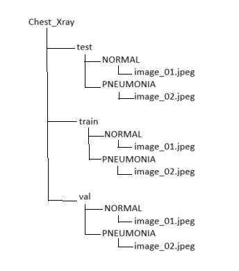

# Pneumonia Detection Using Deep Learning

## Overview
This project implements a deep learning model to classify **chest X-ray images** as either **Normal** or **Pneumonia**. The model uses **ResNet-50**, a pre-trained convolutional neural network (CNN), with **transfer learning** to effectively detect pneumonia from X-ray images. The project also includes data preprocessing, augmentation, and evaluation techniques to improve model performance.

## Features
- **Automated Pneumonia Classification:** Classifies chest X-ray images into "Normal" or "Pneumonia" to assist in fast, accurate diagnosis.
- **Transfer Learning:** Leverages a pre-trained **ResNet-50** model to extract features and fine-tunes it to classify pneumonia, reducing the need for large datasets.
- **Data Augmentation:** Utilizes **ImageDataGenerator** for real-time data augmentation, improving model robustness and generalization.
- **Performance Metrics:** Evaluates model performance using **accuracy**, **precision**, **recall**, **F1-score**, **AUC-ROC**, and **confusion matrix**.

## Requirements
- Python 3.x
- Libraries:
  - TensorFlow
  - Keras
  - NumPy
  - Matplotlib
  - Pandas
  - scikit-learn
  - OpenCV
  - imbalanced-learn (for SMOTE)
  - matplotlib

## Dataset

The dataset used in this project consists of **chest X-ray images** categorized into two classes: **Normal** and **Pneumonia**. The data is split into:
- **Training Set**: Used to train the model.
- **Validation Set**: Used to tune the model's hyperparameters.
- **Test Set**: Used to evaluate the model's performance on unseen data.

Each image is resized to **224x224 pixels** to be compatible with **ResNet-50**.

The dataset can be downloaded from the following link:
[Download Chest X-ray Pneumonia Dataset](https://www.kaggle.com/datasets/paultimothymooney/chest-xray-pneumonia?resource=download)

### Dataset Structure

## Usage

1. **Data Preprocessing:**
   - Images are resized to 224x224 pixels for compatibility with ResNet-50.
   - Grayscale images are converted to RGB.
   - Pixel values are normalized to the range [0, 1].
   - SMOTE (Synthetic Minority Over-sampling Technique) is applied to address class imbalance.

2. **Model Architecture:**
   - **ResNet-50** is used as the base model for feature extraction. The model is pre-trained on ImageNet and fine-tuned for pneumonia detection.
   - The base model layers are frozen initially and then unfrozen for fine-tuning.
   - A custom classification head is added with dense layers and a sigmoid output for binary classification.

3. **Model Training:**
   - The model is trained for 10 epochs with a **batch size of 32** using the **Adam optimizer** and **binary cross-entropy loss**.
   - Data augmentation is applied during training to improve generalization.
   - The model is evaluated using the validation set and tested on the test set.

4. **Performance Evaluation:**
   - The model’s performance is evaluated using accuracy, precision, recall, F1-score, AUC-ROC, and confusion matrix.
   - A ROC curve is plotted, and the AUC score is computed to assess model performance.

## Results

1. **Training Accuracy:** 98.72%
2. **Test Accuracy:** 87.0%
3. **AUC-ROC:** 0.513
4. **Confusion Matrix:** Provides insight into false positives, false negatives, true positives, and true negatives.

